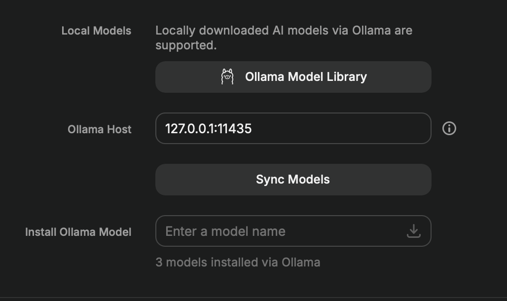

# Claudama

Use your **Claude subscription** as a Raycast AI provider — instead of paying per-token.

claudama wraps the [`claude`](https://docs.claude.com/en/docs/claude-code) CLI in an Ollama-compatible HTTP server, so any tool that speaks Ollama (Raycast first and foremost) can talk to Claude through your existing Claude Code subscription.

## Quick start

1. **Install via Homebrew:**

   ```sh
   brew install atelpis/tap/claudama
   brew services start claudama   # one-time; auto-starts on login from here on
   ```

   > **Already running Ollama?**
   >
   > If Ollama is on its default port (11434), claudama needs to move out of the way. Change its port in `/opt/homebrew/etc/claudama/conf.toml` (or `/usr/local/etc/...` on Intel):
   >
   > ```toml
   > port = 11435
   > ```
   >
   > Then `brew services restart claudama`, and in *Raycast Settings → AI → Ollama* update the host to `http://127.0.0.1:11435`.
   >
   > 

2. **Sync models in Raycast:** open *Raycast Settings → AI → Ollama* and click **Sync Models**. You should now see Claudama Haiku, Sonnet, and Opus in the list of models.

3. **Wire up Raycast AI:** assign them to your Quick AI, Chat, and Commands as you like.

   

That's it — Raycast AI now runs on your Claude subscription.

## Alternative installation

From source:

```sh
go install github.com/atelpis/claudama/cmd/claudama@latest
claudama
```

Requires an installed and authenticated `claude` CLI on `$PATH`.

## Configuration

Config is file-only. Lookup order — first existing file wins:

1. `~/.config/claudama/conf.toml`
2. `/opt/homebrew/etc/claudama/conf.toml`
3. `/usr/local/etc/claudama/conf.toml`

Only the fields you specify override the defaults.

Full default config:

```toml
# Port claudama listens on (127.0.0.1 only).
port = 11434

# Absolute path to the `claude` binary. Leave empty to resolve via $PATH.
# Set this when running under `brew services`, where launchd does not inherit
# a useful PATH.
claude_path = ""
```
